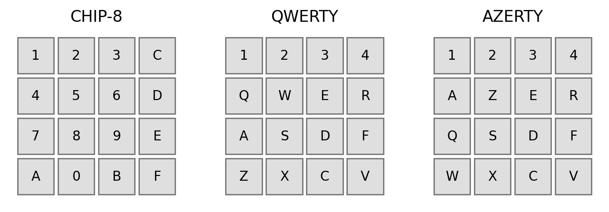

# fc8

Fortran CHIP-8 interpreter

## Building fc8

### Prerequisites

The following tools and libraries are required:

* Fortran 2008 compiler such as `gfortran` or `ifx`
* C compiler
* CMake v3.16 or higher
* Xlib - the X window system protocol client library
* (alternative, still beta-quality) SDL2

### Build steps

Clone the repository and build using CMake
```txt
$ git clone
$ mkdir build && cd build
$ cmake .. -DFC8_KEYBOARD=qwertz
$ make
```
The keyboard binding is fixed at compile time. You can select between:
- `qwerty` (default)
- `qwertz`
- `azerty`

If the build was succesful, you should now be able to play a CHIP-8 game using:
```
$ ./fc8 <path/to/cartridge>
```

## Using fc8

The full set of command-line options is:
```
Usage: fc8 [-h] [-s] [-zoom=Z] [--config=FILE] <path-to-ch8>

  Fortran CHIP-8 interpreter

required arguments:
  <path-to-ch8>           a CHIP8 ROM file

options:
  -h, --help              show this help text and exit
  -v, --version           display version and exit
  -s, --silent            silent mode (disable audio)
  --zoom=Z                zoom percentage, 30 <= Z <= 200
  --display=:N            server display number; the default is 0
  --config=FILE           configuration file: a Fortran namelist

```

The interpreter display responds to the following keys
- <kbd>Escape</kbd>: Quit fc8
- <kbd>0</kbd>: Reload ROM file ("replay")

The CHIP-8 keypad is bound to conventional keyboards as follows:



### X-forwarding

When the X11 version of fc8 was built, you can run it on a remote machine using X-forwarding. To do so you must have a running X-server (e.g. Xming on Windows, XQuartz on Mac). After logging in with
```
$ ssh -Y <userID>@<destination>
```
you should be able to run fc8 remotely.

## Examples

Some example ROMs can be bound in the `cartridges/` directory. ROMS/cartridges can be loaded at the command line:
```
$ ./fc8 <cartridge>
```

## Tests

To test the interpreter, I have used the ROM images found in the following third-party repositories (in this order of helpfulness):
- https://github.com/Timendus/chip8-test-suite
- https://github.com/corax89/chip8-test-rom
- https://github.com/mattmikolay/chip-8
- https://github.com/Skosulor/c8int

It's often insightful to compare results with interpreters of others. Here are just a few:
- https://bluishcoder.co.nz/js8080/
- https://chip8.iorel.nl/
- https://greysonp.gitlab.io/chip8-js/

(Note that many interpreters found on the internet are incomplete or misinterpret certain opcodes. In some cases, also the ROMs are broken or rely on implementation quirks.)

Larger collection of games and other demos can be found in:
- https://github.com/dmatlack/chip8
- https://johnearnest.github.io/chip8Archive/
- http://pong-story.com/chip8/

## Graphics and keyboard input

* [SDL](https://github.com/libsdl-org/SDL) and [fortran-sdl2](https://cyber.dabamos.de/programming/modernfortran/sdl.html)
* [GLUT/OpenGL](https://www.opengl.org/resources/libraries/glut/spec3/spec3.html)
* [GTK](https://www.gtk.org/) and [gtk-fortran](https://github.com/vmagnin/gtk-fortran)
* [X11](https://www.x.org/wiki/) or [XCB](https://xcb.freedesktop.org/)
* [Wayland](https://wayland.freedesktop.org/)
* [Win32 (Windows)](https://learn.microsoft.com/en-us/windows/win32/)
* [AppKit (MacOS)](https://developer.apple.com/documentation/appkit?language=objc)
* [EGGX/ProCALL](https://www.ir.isas.jaxa.jp/~cyamauch/eggx_procall/) (no support for key-release detection)

One of my aims in this project was to investigate design patterns. One of the 
typical design problems in game development (or graphical programs in general)
is how to support different graphical engines on different platforms.

The easy solution is to pick a graphics framework with widespread platform 
support. This way all of the platform specific issues are pushed down into the
graphical layer. 

Obviously, the requirements of a black and white, 2D game view are low compared
to more realistic programs, however the designs patterns still apply.

## Writing and editing ROMs manually

For a true experience you can write the games by hand in pseudo-assembly,
and compile them to hex manually. You can use a hex editor such as [`hexyl`](https://github.com/sharkdp/hexyl) or [`hexedit`](http://rigaux.org/hexedit.html) to save and edit your CHIP-8 programs. 

The `hexdump` tool can be used to quickly inspect a cartridge (watch out as different tools might display the byte-order differently). Alternatively, [HexEd.it](https://hexed.it/) client-side JavaScript based hex editor is a more powerful tool which runs in the browser.

## CHIP8 Assemblers

A far better developer experience is to use a high-level assembler. The most famous one today is [Octo](http://johnearnest.github.io/Octo/), which also includes a disassembler and emulator, as well as a sprite editor. A second alternative is [Dorito](https://github.com/lesharris/dorito).

Personally, I have found the [`customasm`](https://github.com/hlorenzi/customasm) tool working well too. Examples of CHIP8 programs written in a custom assembly language can be found in the `asm/` folder of this repository.

Other assemblers:
- [c8c](https://github.com/glouw/c8c)
- [c8asm](https://github.com/wernsey/chip8)
- [Chip8Assembler](https://github.com/craigthomas/Chip8Assembler)
- [asmchip8](https://pypi.org/project/asmchip8/)

## Other resources

* [How to write an emulator (CHIP-8 interpreter) | Laurence Muller](https://multigesture.net/articles/how-to-write-an-emulator-chip-8-interpreter/)
* [Introduction to CHIP-8 | Emulator 101](http://www.emulator101.com/introduction-to-chip-8.html)
* [CHIP-8 Technical Reference](https://github.com/mattmikolay/chip-8/wiki/CHIP%E2%80%908-Technical-Reference)
* [Emulating the Chip8 system | codeslinger.co.uk](http://www.codeslinger.co.uk/pages/projects/chip8.html)
* [Chip-8 on the COSMAC VIP: Keyboard Input | Laurence Scotford](https://laurencescotford.com/chip-8-on-the-cosmac-vip-keyboard-input/)
* [CHIP-8 Reference | Gulrak's CHIP8 Cave](https://chip8.gulrak.net/reference/)
* [Guide to making a CHIP-8 emulator | Tobias V. Langhoff](https://tobiasvl.github.io/blog/write-a-chip-8-emulator/)
* [How are held-down keys handled in CHIP-8? | Retrocomputing](https://retrocomputing.stackexchange.com/questions/358/how-are-held-down-keys-handled-in-chip-8)
* [BUILDING A CHIP-8 EMULATOR [C++] | Austin Morlan](https://austinmorlan.com/posts/chip8_emulator/#16-input-keys)

### Explore

- [CHIP-8 (GitHub)](https://github.com/topics/chip8)
- [CHIP-8 (GitLab)](https://gitlab.com/explore/projects/topics/CHIP-8)

## Acknowledgements

Special thanks goes to:

- [@vmagnin](https://github.com/vmagnin/), for supportive discussions, and testing of the build system and keyboard bindings on various platforms
- [@interkosmos](https://github.com/interkosmos), for supportive discussions, code suggestions and educational Fortran content